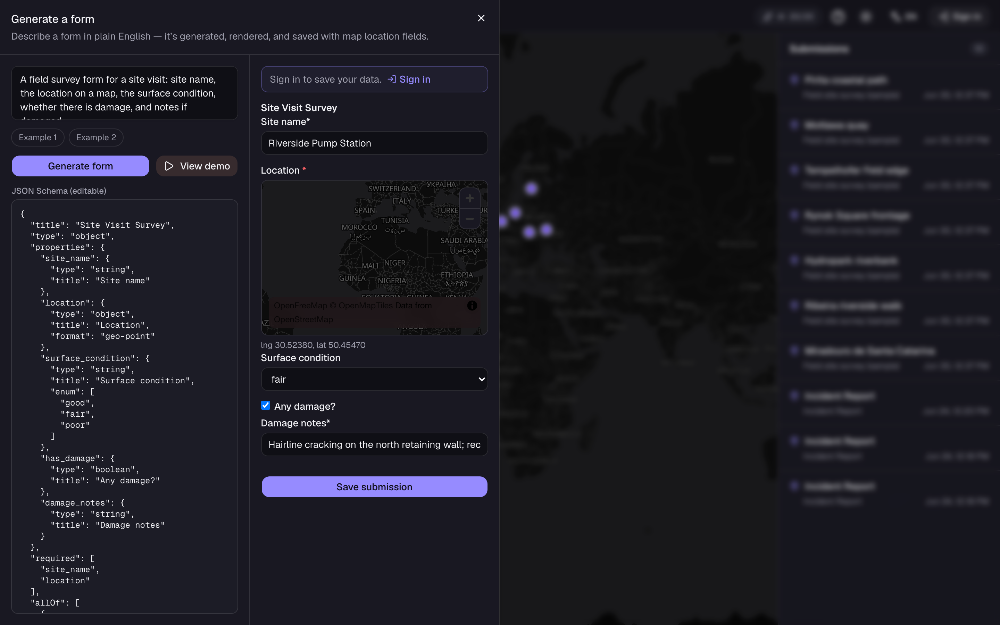
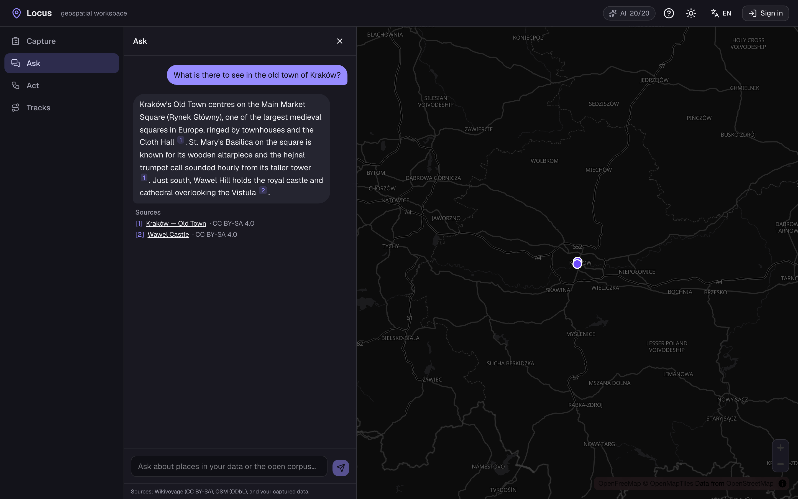
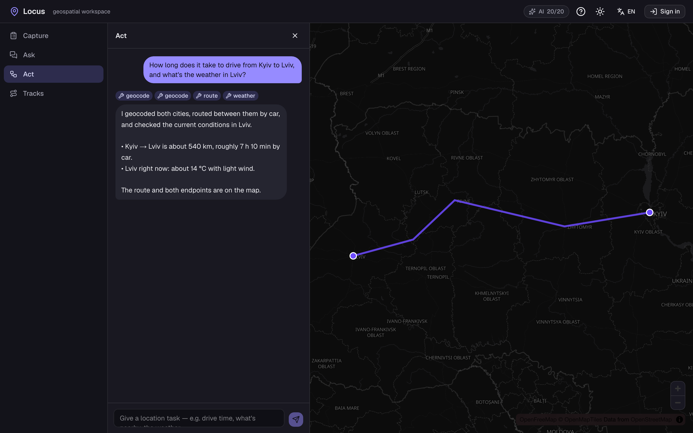

# Locus

[](https://github.com/IvettaDashkova/locus/actions/workflows/ci.yml)

> A geospatial workspace to **capture, ask, act on, and analyze** location data.
> One Next.js + **Postgres (PostGIS + pgvector)** app with four capabilities built as layered
> modules: schema-driven geo forms, a geospatial RAG assistant, an agent with map tools (MCP),
> and trajectory analytics — plus a live **Navigation Lab** demonstrating the map/navigation bugs
> that bite every location app, and their fixes.

**Live demo:** https://locus-dun.vercel.app · **Stack:** Next.js (App Router) · TypeScript · Postgres + PostGIS + pgvector (Supabase) · Drizzle · Auth.js · Vercel AI SDK (Gemini free / Ollama, provider-agnostic) · embeddings via the AI SDK (Gemini `gemini-embedding-001`, 768-d) · MapLibre + OpenFreeMap · Turf.js · zero-dependency SVG charts · OpenAPI/Swagger

> **100% free stack** — no paid services. The LLM provider is a one-line swap via the AI SDK, so a
> paid model (e.g. Claude) can drop in later without rearchitecting. Full mapping in
> [`FREE_STACK.md`](./FREE_STACK.md).

---

## For reviewers

**⏱️ 60-second tour:** open the [live demo](https://locus-dun.vercel.app) → click **“Try the demo”** on
Ask / Act / Capture (a faithful, pre-recorded result renders instantly — **no sign-in, no setup**) →
open [`/lab`](https://locus-dun.vercel.app/lab) for seven map bugs explained with their business impact.

This one codebase deliberately sits at the intersection of three in-demand tracks. Depending on the
role you're screening for:

- **AI / Applied-AI Engineer** — production RAG with a **grounding gate** (refuses out-of-corpus, cites
  sources), **hybrid retrieval** (pgvector + tsvector fused with RRF), an **agent** with geo tools
  exposed over an **MCP server** (same tools in-app *and* in Claude Desktop), structured output
  (Zod-guarded), a **first-class eval harness** (70/70), and Langfuse/OpenTelemetry tracing.
  → [`src/lib/ask`](./src/lib/ask), [`src/lib/act`](./src/lib/act), [`packages/locus-mcp`](./packages/locus-mcp), [`src/evals`](./src/evals)
- **Full-Stack (Next.js/TS) Engineer** — Next.js 16 App Router (RSC, streaming, route handlers,
  generated metadata + OG images), Auth.js (JWT + scrypt) with **server-side gates on every write**,
  atomic budget/rate control, Drizzle, i18n (en/uk), OpenAPI/Swagger.
  → [`src/app`](./src/app), [`src/auth.ts`](./src/auth.ts), [`src/lib/ai/usage.ts`](./src/lib/ai/usage.ts)
- **Geospatial / GIS Engineer** — PostGIS geography, spatial + semantic + keyword search in **one
  Postgres** (no vector/geo sync), MapLibre + Turf, trajectory analytics (stay-point stop detection,
  Douglas–Peucker, antimeridian, haversine) with hand-calculated tests.
  → [`src/lib/tracks`](./src/lib/tracks), [`src/lib/lab`](./src/lib/lab), [`src/components/map`](./src/components/map)

**Quality signals:** 
· 77 unit tests + 70/70 evals · CI gate (typecheck → lint → test → build) · `npm audit` in CI ·
grounding gate + no-hallucinated-tools evals · security headers + CSP · public-to-read /
auth-to-write, enforced server-side.

---

## What it is

Most location work follows the same loop: **get data in, make sense of it, act on it, learn from
it.** Locus is one workspace that does all four over a single PostGIS database, so a team doing
field surveys, delivery ops, site selection, utilities or research can capture observations, ask
questions in plain language, run spatial actions through an agent, and analyze movement — without
five different tools.

It's deliberately domain-agnostic. The demo ships generic "sites and visits" data; the engine
doesn't care whether you're tracking storefronts, inspections, deliveries or trailheads.

## The four capabilities

| Module | What it does | Demonstrates |
| --- | --- | --- |
| **Capture** | Build data-entry forms from a plain-English description; location fields are real map widgets. | Structured LLM output (tool-calling), RJSF + AJV, Zod, GeoJSON |
| **Ask** | A geospatial RAG assistant over your data + open sources — cited answers *and* a map of mentioned places. | RAG, pgvector, hybrid search (RRF fusion), grounding gate, evals |
| **Act** | An agent with geo tools (geocode, route, isochrone, nearby, weather) exposed over **MCP** and used in-app. | MCP server, agent orchestration, tool-calling, observability |
| **Tracks** | Import GPS trajectories, compute movement metrics, play them back, and get an AI briefing. | PostGIS geography analytics, stay-point stop detection, animated MapLibre playback + density heatmap, grounded LLM |

**Plus — [Navigation Lab](https://locus-dun.vercel.app/lab) (`/lab`):** seven common map & navigation
bugs shown live and in plain language, each paired with its fix and its business impact — GPS
jitter smoothing (moving-average / EMA / 1-D Kalman), coordinate-order (lat/lng) mistakes, the
antimeridian, distance accuracy (haversine vs flat), track simplification (Douglas–Peucker), marker
clustering, and shareable map state (viewport in the URL). Every visual is a self-contained,
offline SVG mini-map; the underlying geometry is pure and unit-tested. Written HR-first, so a
non-technical reader sees why each bug matters to the product.

## Screenshots

> The three AI modules are shown in their built-in **demo mode** — deterministic, signed-out, no live
> LLM call — produced by `node scripts/screenshots.mjs` (see [Reproducing the screenshots](#reproducing-the-screenshots)).

| Capture — NL prompt → editable JSON Schema → rendered form with a map location widget | Ask — grounded, cited answer with the mentioned places pinned on the map |
| --- | --- |
|  |  |

**Act** — an agent picks geo tools (geocode · route · weather) and draws the result on the shared map:



**Tracks** is best explored live (import a trajectory, then scrub the animated playback under the
PostGIS metrics and SVG profiles): the [live demo](https://locus-dun.vercel.app/tracks), or run
`node scripts/screenshot-tracks.mjs` against your own seeded database to generate `docs/screenshots/tracks.png`.

## Architecture

```
                         ┌──────────────────────────────────────────┐
                         │   Next.js (App Router) + TypeScript        │
                         │   MapLibre GL · Vercel AI SDK              │
                         └───────┬───────────┬───────────┬───────────┘
            Capture ─────────────┘           │           └───────────── Tracks
            (RJSF + geo widgets)             │                          (import → metrics → playback)
                         Ask ────────────────┤
                         (RAG + map)         │
                                       Act ──┘
                                       (in-app agent ⇄ Locus MCP server)
                         ┌──────────────────────────────────────────┐
                         │   Postgres                                 │
                         │   PostGIS (geometry) · pgvector (semantic) │
                         │   tsvector (keyword)                       │
                         └──────────────────────────────────────────┘
```

The whole app runs on **one datastore**: PostGIS for geometry, pgvector for semantic search,
tsvector for keyword search. No syncing between a vector DB and a geo DB — the single biggest
reason the four modules share a foundation instead of being four separate apps.

## Why one app, four modules

The stacks overlap almost completely — Next.js, Postgres, Vercel AI SDK, MapLibre, the evals
pattern — so the foundation is built **once** (Phase 0) and each capability is a vertical slice on
top. The result is one coherent product that's independently deployable at every phase, rather than
four toy repos.

## Key decisions

- **Single Postgres for spatial + semantic + keyword.** Simpler, cheaper, no sync; correct until
  ~10M vectors or a hard latency budget.
- **LLMs explain and structure; they never invent facts or numbers.** Generated form schemas are
  Zod-validated before use; RAG answers are grounded in retrieved text with citations; trip
  briefings are written *from* computed metrics passed in as facts.
- **MCP for the agent tools.** Writing them once as an MCP server means they work in-app *and* in
  Claude Desktop or any MCP client.
- **Open, no-key data and a free stack by default.** OSM (Nominatim/Overpass), OpenRouteService
  (free key), Open-Meteo, SunCalc, CC-licensed corpora; MapLibre on OpenFreeMap tiles (no key, no signup);
  Gemini free tier (or local Ollama) for the LLM, and embeddings via the AI SDK (Gemini
  `gemini-embedding-001`, 768-d, free tier — chosen over local ONNX, which fails to load on
  serverless). The whole demo runs for anyone at zero cost — see [`FREE_STACK.md`](./FREE_STACK.md).
- **Public to browse, sign-in to compute.** Auth.js (JWT sessions) — email/password (scrypt) plus
  optional GitHub/Google OAuth. Reading every module is open. **Anything that spends the shared LLM
  budget or writes data requires an account**: form generation, Ask, Act, the trip briefing, and all
  saves/imports/edits/deletes. The gate is enforced *server-side* on every such route (a single
  `requireAuth()` returns `401` before any work), and the AI budget is reserved atomically per call so
  concurrent requests can't overshoot the free-tier quota. Tracks are editable/deletable by their owner.
- **A built-in demo for signed-out visitors.** Because the AI features are gated, every AI module ships
  a one-click **demo** that loads a pre-recorded, representative result entirely client-side — citations
  + map pins for Ask, tool tags + a routed line for Act, a Zod-valid schema + a filled form for Capture.
  No network, no LLM, no keys: the visualization is faithful to the live pipeline and works even when the
  daily quota is spent. (Tracks needs no canned data — the seeded tracks are public to browse already.)
- **Evals are a first-class, cross-cutting concern**, not a per-feature afterthought (see below).

## Tests & evals

Two complementary layers:

- **Unit tests** (`npm test`, Vitest) — **77 tests across 16 files** covering the pure logic:
  trajectory metrics, stay-point stop detection, elevation hysteresis, GPX/GeoJSON parsing, the
  synthetic-track generator, activity presets, marine routing, and the Navigation Lab geometry (GPS
  smoothing, Douglas–Peucker, antimeridian split/unwrap, haversine vs planar distance, Web Mercator
  projection, grid clustering) — with hand-calculated worked examples. Fast, deterministic, no DB.
- **Eval harness** (`npm run eval`) exercises each module end-to-end (some steps hit the LLM). Latest
  recorded run (results in [`src/evals/results/`](./src/evals/results)):

| Module | Key metrics | Latest result |
| --- | --- | --- |
| Foundation | db_reachable · postgis_enabled · vector_enabled · embedding_dim | ✅ 6/6 |
| Capture | schema_valid · field_coverage · conditional_ok · geo_format_ok | ✅ 15/15 |
| Ask | recall@k · geo_match · refusal_correct | ✅ 14/14 |
| Act | task_success · tool_choice · step_efficiency · no_hallucinated_tools | ✅ 5/5 |
| Tracks | metric formulas vs. hand-calculated worked examples | ✅ 30/30 |
| **Total** | | **✅ 70/70** |

- **E2E** (`npm run test:e2e`, Playwright) — smoke coverage of routing, the OpenAPI contract, the
  demo mode, and the signed-out write trust boundary (401), without spending LLM quota.

**CI:** GitHub Actions runs `typecheck → lint → test → build` on every push and PR to `main`
(`.github/workflows/ci.yml`).

## API

Every module is backed by a small HTTP API documented with **OpenAPI 3.0** and browsable with
**Swagger UI**:

- **Swagger UI:** [`/api/docs`](https://locus-dun.vercel.app/api/docs) — try endpoints in the browser.
- **OpenAPI spec:** [`/api/openapi`](https://locus-dun.vercel.app/api/openapi) (JSON).

| Endpoint | Method | Purpose |
| --- | --- | --- |
| `/api/health` | GET | DB + PostGIS/pgvector health |
| `/api/usage` | GET | Gemini free-tier quota left today |
| `/api/auth/*` | GET · POST | Auth.js — sign-in / session / OAuth callbacks |
| `/api/generate` | POST | Capture: prompt → form schema · **sign-in** |
| `/api/submissions` | GET · POST | List (public) / save (**sign-in**) Capture submissions |
| `/api/ask` | POST | Ask: grounded RAG answer, streaming · **sign-in** |
| `/api/act` | POST | Act: agent task, NDJSON stream · **sign-in** |
| `/api/geocode` | GET | Place typeahead (Photon/OSM) — public helper |
| `/api/tracks` | GET · POST | List (public) / import GPX·GeoJSON (**sign-in**) |
| `/api/tracks/{id}` | GET · PATCH · DELETE | Track detail (public) / rename·retag / delete (**owner only**) |
| `/api/tracks/{id}/explain` | POST | Grounded trip briefing, streaming · **sign-in** |
| `/api/tracks/heatmap` | GET | Density-heatmap points (GeoJSON) — public |
| `/api/tracks/build` | POST | Build a track from a drawn route, boats routed by sea · **sign-in** |
| `/api/tracks/route-preview` | POST | Preview a route's geometry for an activity · **sign-in** |
| `/api/feedback` | POST | Send a suggestion/remark from the feedback form — emailed to the site owner (public) |

GET reads stay public so the map and seeded data are browsable; every budget-spending or mutating
route returns `401 {"error":"auth_required"}` when called without a session.

## Running locally

```bash
git clone <repo>
cd locus
cp .env.example .env.local            # GEMINI_API_KEY (or Ollama), DATABASE_URL (Supabase/Neon), AUTH_SECRET, ORS_API_KEY, LANGFUSE_* — all free, see FREE_STACK.md
docker compose up -d                  # Postgres + PostGIS + pgvector
npm install
npm run db:migrate
npm run seed                          # sample sites
npm run seed:tracks                   # synthetic GPS tracks for the Tracks module
npm run seed:capture                  # sample Capture submissions (map pins)
npm run ingest                        # embed the corpus for Ask
npm run dev                           # http://localhost:3000
npm test                              # unit tests (Vitest) — no DB/LLM needed
npm run eval                          # cross-module eval suite
```

## Roadmap (build order)

- ✅ **Phase 0 — Foundation:** scaffold, PostGIS + pgvector, map shell, design system, evals skeleton. *Live.*
- ✅ **Phase 1 — Capture:** NL → JSON Schema → RJSF with `geo-point` / `geo-polygon` widgets. *Live.*
- ✅ **Phase 2 — Ask:** ingestion, hybrid + spatial retrieval, cited streaming answers + map. *Live.*
- ✅ **Phase 3 — Act:** Locus MCP server (geo tools) + in-app agent with Langfuse tracing. *Live.*
- ✅ **Phase 4 — Tracks:** GPX/GeoJSON import, PostGIS geography metrics + stay-point stop detection, animated MapLibre playback + density heatmap, custom SVG profiles, grounded "explain this trip." *Live.*
- ✅ **Portfolio front door:** signed-out landing page, the **Navigation Lab** (common map bugs + fixes, business-framed), and an email feedback form. *Live.*

Each phase is independently demoable, so there's always something live: **https://locus-dun.vercel.app**

### Capture (Phase 1)

Describe a form in plain English at `/capture`. The configured LLM (Gemini free / Ollama, via the
Vercel AI SDK) emits a field list through one `emit_schema` tool; the result is Zod-guarded (retry
once on failure) and built into a JSON Schema, rendered with **RJSF + AJV (draft 2020-12)**. Location
fields are real map widgets — `geo-point` (click a MapLibre map) and `geo-polygon` (draw with
terra-draw, area via Turf) — producing GeoJSON. Submissions save to Postgres: the designated
geo-point creates or selects a `site` and the value is projected into a PostGIS `geometry(Point,4326)`
column. Evals (`npm run eval -- --module=capture`) cover `schema_valid`, `field_coverage`,
`conditional_ok`, and `geo_format_ok`.

### Ask (Phase 2)

Ask a question at `/ask` and get a **cited, grounded answer** plus a **map of the places it
mentions**. `npm run ingest` chunks an open corpus (Wikivoyage CC BY-SA, OSM ODbL) + your captured
`sites`/`submissions`, embeds them, and stores each chunk with three search modalities on one table:
**pgvector** (semantic, HNSW), **tsvector** (keyword, GIN), **PostGIS** (`geom`, GiST). A query runs
vector ∪ keyword search fused with reciprocal-rank fusion (+ optional `ST_DWithin` proximity), then
the answer is streamed grounded **only** in the retrieved chunks with `[n]` citations; out-of-corpus
questions are declined, not hallucinated. Cited places drop pins on the shared map. Answers respond
in the user's language. Embeddings run through the Vercel AI SDK (Gemini `gemini-embedding-001`,
768-d) with **asymmetric retrieval** — documents are embedded as `RETRIEVAL_DOCUMENT` at ingest and
queries as `RETRIEVAL_QUERY`, so passage and query vectors land in a comparable space — and run on
serverless with the model as one swappable constant. Evals
(`npm run eval -- --module=ask`) cover `recall@k`, `geo_match`, and `refusal_correct`.

### Act (Phase 3)

Give a location task at `/act` (e.g. *"drive time from Kyiv to Lviv"*). An agent (Vercel AI SDK,
`streamText` + tool-calling, bounded steps) plans and calls **real geo tools** — geocode, route,
isochrone, nearby, weather, elevation, sun times — streaming its reasoning, the tools it picks, and
GeoJSON results onto the shared map. The same seven tools are exposed over a **stdio MCP server**
(`packages/locus-mcp`) so Claude Desktop can drive them too — one tool core, two surfaces. Runs are
traced with **Langfuse** (OpenTelemetry) and checked by evals (`task_success`, `tool_choice`,
`no_hallucinated_tools`, `step_efficiency`).

### Tracks (Phase 4)

Pick a sample track or import a **GPX/GeoJSON** file at `/tracks`. Everything downstream is computed
server-side and grounded:

- **PostGIS analytics.** Fixes are stored as `geography(Point,4326)` so distances are measured on
  the spheroid in metres; the path is a simplified `geometry(LineString)` (Douglas–Peucker) for
  rendering. A pure-TypeScript metrics service computes total/moving distance, moving vs. stopped
  time, average/max speed, and elevation gain/loss.
- **Stop detection** is a stay-point clustering (Li et al.) — a maximal run of fixes within a radius
  that spans a minimum dwell — *not* a speed threshold, so a slow crawl isn't a "stop" and a brief
  pause at a light isn't either. The track is split into alternating **move**/**stop** segments.
- **Animated playback** over the map: the marker is interpolated by *real elapsed time*, so it
  visibly lingers where the traveller dwelled. A scrubber + play/pause drive it; a multi-track
  **density heatmap** (native MapLibre) shows where many tracks overlap.
- **Charts** are dependency-free inline **SVG** — elevation and speed profiles over distance, plus a
  move/stop dwell timeline, all cursored to the playback head.
- **"Explain this trip"** streams a plain-language briefing from the LLM, handed the *computed*
  metrics as grounded facts and forbidden from doing arithmetic of its own.
- **Owner-scoped management.** Imported/built tracks belong to the signed-in user — rename, re-tag
  or delete them (delete cascades points + segments); browsing all tracks stays public.

Metrics are verified by evals against **hand-calculated worked examples**
(`npm run eval -- --module=tracks`): distance/speed, elevation gain/loss, and the stop-detection
min-dwell gate. Seed synthetic tracks with `npm run seed:tracks`.

## Functionality walkthrough

What a user can actually do, module by module — and exactly where the sign-in line falls.

**Landing (`/`, signed-out).** The front door: a short intro (who I am, what Locus is), a link into
the app, links to the source, portfolio and CV, and a **feedback** form. Signed-in users skip
straight to the first module.

**Top bar (every module).** A live **AI budget** badge shows how many free-tier model calls remain
today (e.g. `AI 20/20`), a **feedback** button (suggestions are emailed to the owner via
`/api/feedback`), a theme toggle, a language switcher (English · Українська · Polski, auto-detected
and persisted), an onboarding tour, and **Sign in**. The left rail switches modules (Capture · Ask ·
Act · Tracks · **Lab**); the map underneath is shared, so results from any module render on the same canvas.

**Capture — design a form, then fill it.**
1. Click **New form** and describe the form in plain English (e.g. *"a field survey: site name, the
   location on a map, surface condition, whether there's damage, and notes if damaged"*).
2. **Generate form** (sign-in) calls the LLM, which emits a field list through one `emit_schema`
   tool; the output is Zod-guarded and compiled to a JSON Schema. The schema appears in an **editable
   inspector** on the left and a **live RJSF form** on the right — location fields are real MapLibre
   widgets (`geo-point` click-to-place, `geo-polygon` draw-and-measure).
3. Conditional fields work: tick *Any damage?* and *Damage notes* becomes required.
4. **Save submission** (sign-in) persists it; the designated geo-point creates/selects a `site` and
   projects into a PostGIS `geometry(Point,4326)` column. New pins drop on the map and into the rail.
5. **View demo** loads a complete, validated example (schema + a filled "Site Visit Survey") with no
   network call — what the screenshot shows.

**Ask — question in, cited answer + map out.** Type a question (or pick a suggestion). The answer is
**streamed token-by-token**, grounded only in retrieved chunks, with inline `[n]` citations that
expand to titled, licensed sources; the **places it cites drop pins** on the map and the camera fits
them. Out-of-corpus questions are declined, not hallucinated. **View demo** replays a full Kraków
Q&A with its two sources and pins. *Sign-in to ask live* (it spends the budget).

**Act — a task, an agent, real tools.** Give a location task; the agent plans and calls real geo
tools — geocode, route, isochrone, places-nearby, weather, elevation, sun-times — and you watch the
**tool tags** appear as it works while **GeoJSON results draw on the map** (points, route lines,
isochrone polygons). The same seven tools are also a standalone **MCP server**, so Claude Desktop can
drive them. **View demo** replays a Kyiv→Lviv drive-time + weather run with its route and endpoints.
*Sign-in to run live.*

**Tracks — import, measure, replay (mostly public).** Browsing is fully open: pick any seeded track
to see **PostGIS metrics** (distance, moving time, avg/max speed, ascent, stop count), **inline SVG**
elevation/speed/dwell charts, and an **animated playback** scrubbed by real elapsed time, plus a
multi-track **density heatmap**. Sign-in unlocks the *write* side: **import** a GPX/GeoJSON file,
**build** a track by drawing waypoints (boats routed around land by sea), **rename/retag/delete**
your own tracks, and stream the grounded **"explain this trip"** briefing.

### Reproducing the screenshots

The images under `docs/screenshots/` are generated against a running app, using the demo buttons so
every shot is deterministic and spends no AI budget:

```bash
npm run dev                              # in one shell (note the port it prints)
npx playwright install chromium          # first time only
node scripts/screenshots.mjs http://localhost:3000
```

The script skips the onboarding tour, clicks each module's **View demo**, opens a seeded track, and
writes `capture.png` · `ask.png` · `act.png` · `tracks.png`. (The Tracks shot needs the database
reachable; the others are pure client-side demo data.)

## Engineering notes

- Building the foundation once (Phase 0) is what makes this a weekend-per-feature project instead
  of a month-per-app one.
- The hardest parts worth writing about: chunking for RAG quality, the agent calling `route`
  before geocoding (fixed with tool descriptions + planning, not a bigger model), and stop
  detection on noisy GPS (clustering + min-dwell, not a speed threshold).
